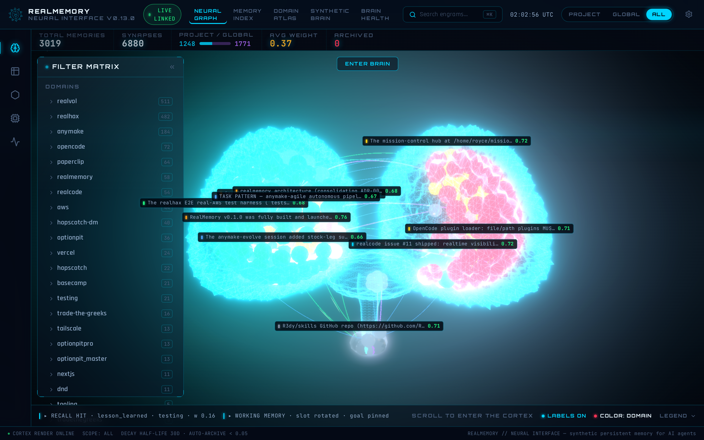
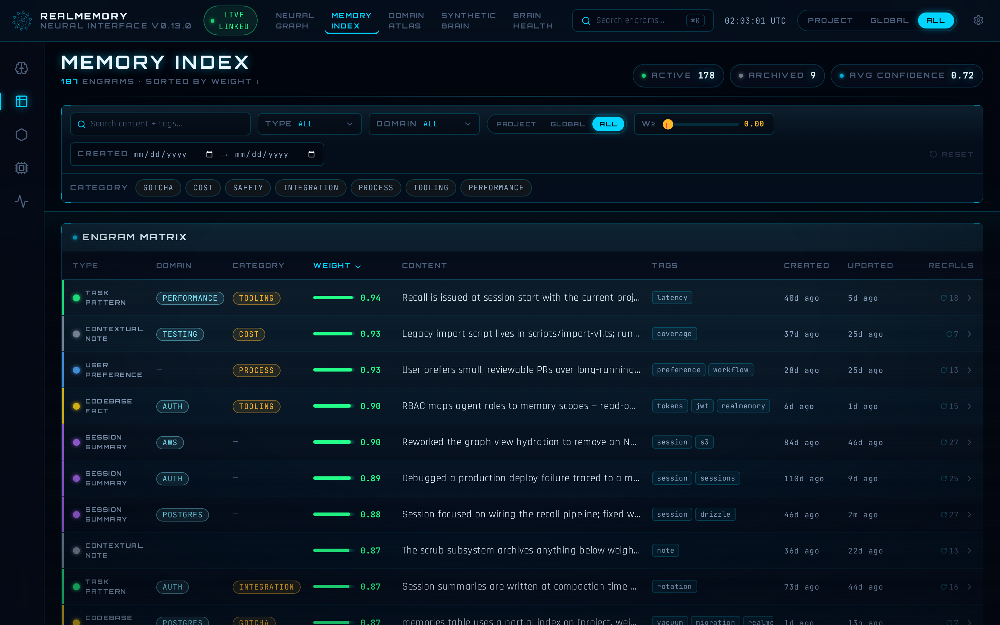
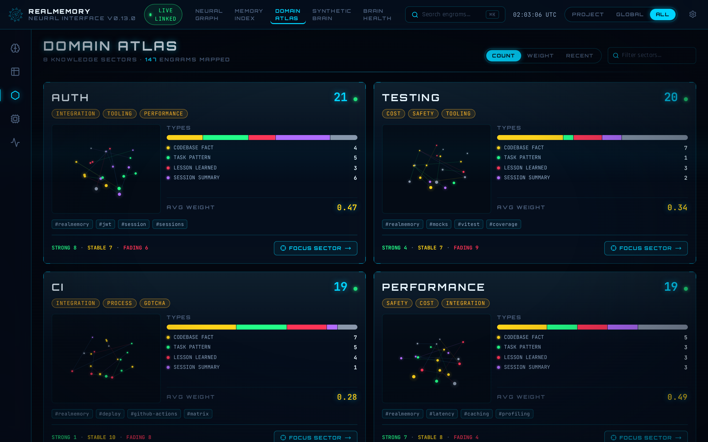
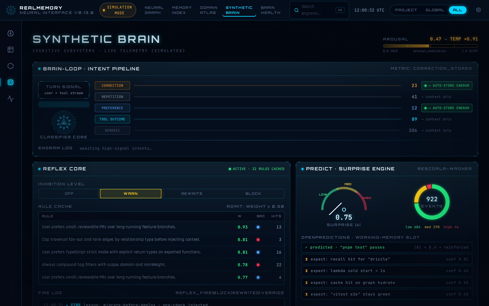
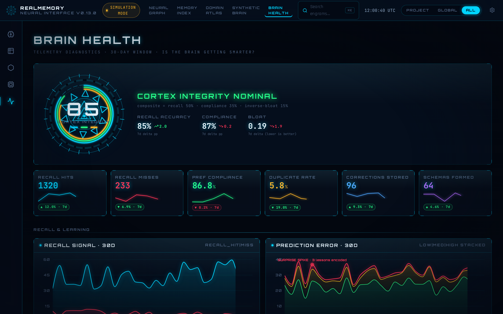

<div align="center">

# 🧠 realmemory

**Persistent memory for AI agents.** A weighted, indexed, relationship-graphed
database that stores what your agent learns across sessions and recalls it
automatically when relevant — local-first, no cloud, installable from git or npm.

[](https://github.com/R3dy/RealMemory/releases)
[](./LICENSE)
[](./tests)
[](https://nodejs.org)
[](https://www.typescriptlang.org/)
[](#how-it-works)
[](#how-it-works)
[](#mcp-tools)

</div>

---

<div align="center">

### The 3D Brain Graph — memories rendered as color-coded neurons clustered by domain



</div>

<div align="center">
<sub>
A live graph browser auto-starts as a localhost-only side channel inside the
MCP server process — no separate flag, no network exposure. Each memory is a
neuron positioned by physics simulation; each typed relationship is a synapse.
</sub>
</div>

---

## The problem

Agents start every session with amnesia. The state of the art for "memory" is a
flat markdown file (`MEMORY.md`, `AGENTS.md`) the agent is instructed to read at
startup. **That's a reading assignment, not memory.** No search, no weighting,
no relationships, no recall-by-relevance — and its context cost grows linearly
with every lesson ever recorded, forever.

realmemory replaces the illusion of learning with actual learning: a searchable,
weighted, related, automatically-recalled store that grows smarter the more the
agent uses it.

## What it does

| | Capability | What it means |
|---|---|---|
| 🔎 | **Hybrid search** | Vector cosine similarity + FTS5 keyword BM25, ranked by `relevance × storedWeight`. |
| ⚖️ | **Weighting** | Recency decay × relevance × frequency × confidence. Stale memories archive automatically. |
| 🔗 | **Relationship graph** | Typed directed edges (`reinforces`, `contradicts`, `extends`, `exception_to`, `derived_from`) traversed one hop during recall. |
| 🪝 | **Automatic recall** | Event hooks inject relevant memories on `session.created` and `chat.message` — no agent action required. |
| 📸 | **Automatic capture** | Tool results (config reads, failed commands) are stored as memories automatically. |
| 🧠 | **Synthetic brain** | A reflex layer (block/rewrite/warn), prediction-error tracking, a working-memory window, and offline consolidation turn memories into cognition. |
| 🖥️ | **3D brain UI** | A localhost-only browser auto-starts: memories as color-coded neurons clustered by domain into anatomical brain regions. |
| 🔌 | **MCP server** | The same memory is reachable from any MCP-compatible client — 12 tools over stdio. |
| 🔒 | **Local-first** | Embedded SQLite + a local ONNX embedding model. No cloud backend, no network calls at runtime. Three runtime dependencies, period. |

## Install

Add realmemory to your `opencode.json`:

```json
{
  "plugin": ["realmemory@git+https://github.com/R3dy/RealMemory.git"]
}
```

After editing `opencode.json`, restart OpenCode. The plugin initializes a SQLite
database at `~/.opencode/realmemory/data.db` (configurable — see
[Configuration](#configuration)) and begins capturing and recalling immediately.
The 3D brain browser auto-starts at `http://127.0.0.1:9333`.

### OpenCode skill

realmemory ships an OpenCode skill at `skills/realmemory/SKILL.md` that gives
the agent proactive memory-use guidance — when to `recall` at the start of a
task, when to `store_memory` (preferences, hard-won facts, decisions, working
approaches), and how to reinforce existing memories instead of duplicating them.
OpenCode discovers the skill automatically from the plugin's `skills/` directory.

## Quick start

1. **Add to `opencode.json`** — `"plugin": ["realmemory@git+https://github.com/R3dy/RealMemory.git"]`.
2. **Restart OpenCode** — the plugin loads on startup and initializes its store.
3. **It works** — memories are captured automatically from tool runs (file reads, failed commands) and recalled automatically when a new session starts or a user message matches stored knowledge. No further configuration required.

To store or recall memories explicitly from any MCP client, point an MCP config at the bundled server:

```json
{
  "mcp": {
    "realmemory": {
      "command": "node",
      "args": ["--experimental-vm-modules", "node_modules/realmemory/dist/bin.js"]
    }
  }
}
```

## The UI

The graph browser is **opt-in-via-default, localhost-only, and read-only** — it
binds to `127.0.0.1` (never the network) and cannot mutate the store. It
auto-starts as a side channel inside the MCP server process (defeatable via
`autoStartBrowser: false` config or the `--no-browser` CLI flag).

<div align="center">

| Page | Screenshot |
|---|---|
| **Neural Graph** — 3D force-directed graph of every memory and its typed relationships. Color by domain (default) or type. |  |
| **Memory Index** — searchable, filterable table of every memory with weight, scope, type, and tags. |  |
| **Domain Atlas** — memories grouped by domain, with per-domain stats and chord-map visualization. |  |
| **Synthetic Brain** — live telemetry of the six cognitive subsystems: brain-loop, reflex, predict, working-memory, consolidate, scrub. |  |
| **Brain Health** — recall hit rate, correction retention, duplicate rate, memory bloat ratio, preference compliance. |  |

</div>

Open `http://127.0.0.1:9333` in your browser to see your own memory graph.
Routes: `/` (neural graph), `/memories` (index), `/domains` (atlas),
`/brain` (synthetic brain), `/vitals` (health metrics).

## How it works

realmemory has six layers:

- **Storage** — a local SQLite database holds every memory as a typed record with content, tags, scope, confidence, weight, timestamps, and an optional vector embedding. Full-text search (FTS5) and the embedding column are indexed alongside the row table.
- **Weighting** — every memory carries a composite weight in `[0, 1]`, computed as `recencyFactor × relevanceFactor × frequencyFactor × confidenceFactor`. Recency decays exponentially (half-life configurable); frequency scales logarithmically with a 0.5 baseline so fresh memories are never zero-weighted; confidence is adjusted up by `reinforces` edges and down by `contradicts` edges. Memories below the archive threshold are auto-archived by `decay()`.
- **Relationships** — a directed graph of typed edges between memories (`reinforces`, `contradicts`, `extends`, `exception_to`, `derived_from`). `reinforces` boosts the source's confidence; `contradicts` decays the target's. Recall traverses one hop in both directions to surface structurally-related context that pure similarity search would miss.
- **Recall** — hybrid. When an embedding provider is configured, the query is embedded and scored by cosine similarity against every matching memory's vector; memories without embeddings fall back to FTS5 keyword matching. When no provider is configured (or it failed to load), recall is keyword-only via FTS5 bm25. Results are ranked by `relevance × storedWeight`, then augmented with related memories.
- **Synthetic brain** — four cognitive subsystems on top of the store: a **reflex layer** that blocks/rewrites/warns on tool calls based on stored rules, **prediction-error** tracking that records surprise when bash/read outcomes diverge from expectation, a **working-memory window** that injects a rolling view of recent memories into every turn, and **offline consolidation** that clusters episodic memories and promotes repeated patterns into durable `task_pattern` rules.
- **Hooks** — the OpenCode plugin wires recall to `session.created` (auto-recall on startup), `chat.message` (auto-recall on user messages), `session.idle` (preference-compliance evaluation + summarization), `session.compacting` (dedup + decay + consolidation), `tool.execute.after` (auto-capture + reflex evaluation + prediction-error recording), and `experimental.chat.system.transform` (recall injection into the system prompt).
- **MCP server** — twelve tools exposed over stdio, so the memory is accessible from any MCP client — other agents, automation scripts, or other tools in the ecosystem.

> **Runtime dependency cap: 3.** `@huggingface/transformers` (local embeddings), `@modelcontextprotocol/sdk` (MCP server), and `better-sqlite3` (storage) — plus `zod` for validation. Enforced by a CI test. Every browser-side viz library (Three.js, react-three-fiber, Tailwind) is a devDependency, compiled to static assets under `src/browser/static/ui/` and served to the browser — never a Node runtime dep.

## Configuration

realmemory loads config from two files, merged in order (later overrides earlier), then merged with defaults:

1. `~/.config/opencode/realmemory.json` (global)
2. `<project>/.realmemory/config.json` (project — overrides global)

Files may use JSONC (`//` comments are stripped). Missing files and invalid JSON are silently ignored so a broken config never crashes the store.

```jsonc
{
  // Path to the SQLite database. ~ is expanded to the user's home directory.
  // Default: "~/.opencode/realmemory/data.db"
  "storagePath": "~/.opencode/realmemory/data.db",

  // Embedding model. Set to null/empty for keyword-only mode (no vector search).
  // Local ONNX models use the "Xenova/..." or "onnxcommunity/..." namespace.
  // Remote OpenAI-compatible APIs require embeddingApiUrl + embeddingApiKey.
  // Default: "Xenova/all-MiniLM-L6-v2"
  "embeddingModel": "Xenova/all-MiniLM-L6-v2",

  // OpenAI-compatible remote embedding endpoint (optional).
  // When both URL and key are set, the remote provider takes precedence over local ONNX.
  "embeddingApiUrl": null,
  "embeddingApiKey": null,

  // Recency decay half-life, in days. A memory aged halfLifeDays has recencyFactor ≈ 0.368.
  // Default: 30
  "decayHalfLifeDays": 30,

  // Minimum relevance score for a memory to be recalled, in [0, 1].
  // Default: 0.3
  "recallThreshold": 0.3,

  // Maximum number of memories returned by recall().
  // Default: 5
  "maxRecallResults": 5,

  // Auto-capture learnings from tool execution (file reads, bash errors).
  // Default: true
  "autoCapture": true,

  // Auto-summarize idle sessions (requires summaryProvider). Off by default.
  // Default: false
  "autoSummarize": false,

  // Summary provider for auto-summarization (required when autoSummarize is true).
  "summaryProvider": null,

  // Weight below which decay() archives a memory, in [0, 1].
  // Default: 0.05
  "archiveThreshold": 0.05,

  // Max related memories returned per recalled memory (one-hop traversal).
  // Default: 3
  "maxRelatedPerMemory": 3,

  // Auto-start the localhost brain browser inside the MCP server process.
  // Default: true
  "autoStartBrowser": true,

  // Synthetic-brain switches. The reflex layer blocks/rewrites tool calls
  // from stored rules; prediction-error records bash/read outcome surprise;
  // working-memory injects a rolling recent-memories view into every turn;
  // consolidation clusters episodic memories and promotes task_patterns.
  // All default to true.
  "brain": {
    "reflex": true,
    "predictionError": true,
    "workingMemory": true,
    "schemaFormation": true,
    "schemaFormationThreshold": 0.80,
    "schemaFormationMinCluster": 3
  }
}
```

## MCP tools

realmemory exposes twelve tools over stdio. Each has a clear, typed argument contract — no overloaded `mode` dispatch.

| Tool | Description |
|------|-------------|
| `store_memory` | Store a new memory (content, type, tags, scope, confidence, relationships, metadata). |
| `recall` | Semantic + keyword search for relevant memories, with optional one-hop relationship traversal. |
| `memory_recall` | Deliberate semantic recall — clearer-named alias of `recall` for agent use. |
| `search` | Structured search with filters (scope, types, tags, weight, date range), sorting, and pagination. |
| `relate` | Create a typed relationship between two memories (`reinforces` boosts source confidence; `contradicts` decays target confidence). |
| `update_memory` | Update an existing memory's content, confidence, tags, metadata, or reinforce it (bumps `reinforcementCount` + confidence). |
| `forget` | Archive (soft) or delete (hard) a memory, cascading its relationships. |
| `list_memories` | Browse memories with simple filters and pagination. |
| `get_memory` | Fetch a single memory by ID, with or without its relationship edges. |
| `memory_note` | Explicit "remember this" — defaults to `lesson_learned`. |
| `memory_why` | Introspection — returns recent reflex block/rewrite/warn/override actions with source memory IDs. |
| `get_metrics` | Brain-loop metrics (recall hit rate, correction retention, duplicate rate, bloat ratio, preference compliance). |

## Memory types

Every memory has one of six types, which govern categorization, indexing, and filtering.

| Type | Description | Example |
|------|-------------|---------|
| `user_preference` | A durable preference about how the user wants things done. | "The user prefers tabs over spaces." |
| `task_pattern` | A recurring pattern in how tasks are approached or structured. | "Bug reports are triaged by severity before assignment." |
| `codebase_fact` | A structural fact about the codebase. | "The API layer is in `src/api/`, backed by Postgres." |
| `lesson_learned` | Something learned the hard way — a failure and its fix. | "AWS `create-image` rejects non-ASCII characters in string params." |
| `session_summary` | A summary of what happened in a session. | "Set up staging; shipped stories 8.1–8.3; parked the metrics dashboard." |
| `contextual_note` | A situational note that doesn't fit the other categories. | "The deploy job is currently paused pending the secrets rotation." |

## Relationship types

Memories are connected by directed, typed edges. Two types have confidence side effects; the rest are structural only.

| Type | Description | Side effect |
|------|-------------|-------------|
| `reinforces` | The source memory supports / re-confirms the target. | Boosts the **source**'s confidence (diminishing returns) and bumps its `reinforcementCount`. |
| `contradicts` | The source memory invalidates the target. | Decays the **target**'s confidence by 10% of its current value. |
| `extends` | The source memory adds detail to the target. | None. |
| `exception_to` | The source memory is a special case of the target rule. | None. |
| `derived_from` | The source memory was concluded from the target. | None. |

## Programmatic API

realmemory is a library first. Import it directly when you want full control over the store lifecycle.

```typescript
import { MemoryStore, RecallEngine } from "realmemory";

const store = new MemoryStore({
  storagePath: "./my-memories.db",
  embeddingModel: null, // keyword-only mode — fast, no model download
});
await store.init();

// Store a memory.
const memory = await store.store({
  content: "The user prefers tabs over spaces",
  type: "user_preference",
  scope: "global",
  confidence: 0.9,
  tags: ["formatting"],
});

// Recall by natural-language query.
const engine = new RecallEngine(store);
const results = await engine.recall({ query: "code formatting preferences", limit: 5 });
for (const r of results) {
  console.log(r.score.toFixed(2), r.memory.content);
}

await store.close();
```

See [`examples/`](./examples) for runnable versions of every major use case.

## Comparison with alternatives

- **`MEMORY.md` / `AGENTS.md`** — a reading assignment, not memory. No search, no weighting, no relationships; context cost grows linearly forever.
- **opencode-mem** — vector search + auto-capture, but no weighting, no relationships, no MCP server, and one overloaded `memory({ mode })` tool.
- **true-mem** — best-in-class 7-feature weighting, but no vector search by default, no relationship graph, no MCP server, and no active query tool.
- **opencode-memini / codex-memory / magic-context** — passive capture/injection cycles with no weighting, no relationships, and no MCP server.
- **mem0 / letta** — capable hosted memory platforms, but cloud-oriented and heavy. realmemory is local-first, three runtime deps, runs anywhere Node runs.
- **codebase-memory-mcp** — indexes *code structure* (functions, calls, imports). realmemory indexes *what the agent learned* — complementary, not a replacement.

realmemory is the only OpenCode plugin that combines (1) a weighted, indexed memory database (SQLite + vector + full-text), (2) a typed relationship graph between memories, (3) automatic recall via event hooks, (4) a synthetic-brain cognition layer (reflex + prediction-error + working-memory + consolidation), and (5) an MCP server for tool-accessible memory — all local-first, installable from git or npm.

## Contributing

1. Fork the repo and clone your fork.
2. `npm install` — pulls dev dependencies and the native `better-sqlite3` binding.
3. `npm run build` — builds `dist/` via `tsup` (required for the smoke test, which imports from `dist/`).
4. `npm test` — runs the vitest suite (currently 722 tests).
5. `npm run typecheck` — `tsc --noEmit`.
6. `npm run lint` — `eslint .`.

Open a PR against `main`. Keep TSDoc on every exported symbol — the build checks for missing docs.

## Architecture

```
                    ┌──────────────────────────────────────────────────┐
                    │                  OpenCode host                    │
                    │                                                  │
   session.created  │  ┌─────────────┐         ┌────────────────────┐  │
   chat.message ────┼─▶│  Plugin     │────────▶│  Hooks             │  │
   session.idle     │  │  (plugin-   │         │  · auto-recall     │  │
   session.compacting│  │   entry.ts) │         │  · auto-capture    │  │
   tool.execute.after│  └─────┬───────┘         │  · reflex          │  │
                    │        │                 │  · prediction-error │  │
                    │        │                 │  · consolidation    │  │
                    │        ▼                 │  · working-memory   │  │
                    │  ┌─────────────┐         └─────────┬──────────┘  │
                    │  │ MCP server  │                   │             │
                    │  │ (stdio,     │                   ▼             │
                    │  │  12 tools)  │         ┌────────────────────┐  │
                    │  └─────┬───────┘         │  MemoryStore       │  │
                    │        │                 │  (SQLite + FTS5    │  │
                    │        │                 │   + vector index)  │  │
                    │        ▼                 └─────────┬──────────┘  │
                    │  ┌─────────────┐                   │             │
                    │  │ Brain UI    │◀──────────────────┘             │
                    │  │ (localhost  │   read-only HTTP /api           │
                    │  │  :9333)     │                                 │
                    │  └─────────────┘                                 │
                    └──────────────────────────────────────────────────┘
                                      │
                                      ▼
                          ~/.opencode/realmemory/data.db
                          (SQLite, WAL mode, local-only)
```

Key design decisions: local-first storage (no cloud, embedded SQLite + local
ONNX embeddings), composite weight (`recency × relevance × frequency ×
confidence`), three-runtime-dependency cap (enforced by CI), `dist/` committed
to git (so git-install consumers get compiled output without a build step),
and a two-pathway cognition model (deliberative hooks on
`session.compacting`/`session.idle` vs reflex interception on
`tool.execute.before`). Full design docs in [`docs/architecture/`](./docs/architecture/).

## Changelog

### v0.19.0

- **Synthetic-self Phase 10 — trait vector.** Six personality traits (caution, curiosity, skepticism, tenacity, thoroughness, tempo), each 0..1 with EMA drift rule at `session.idle`. Traits shift existing constants within clamped bands — never replacing them. New `--reset-self` CLI command restores affected state to baseline. Twin harness (`scripts/twin/`) for A/B comparison of frozen vs drifting installs. Opt-in via `brain.traits` config. (#56)

### v0.18.0

- **3D Brain Graph — glow brightness slider.** A **Glow** slider in the Cortex Display panel that dims every glow surface together (Bloom, neuron emissive, halos, bolts, selection rings, fresnel shells, wireframe) down to true zero. New pure `glow.ts` module with `GLOW_BASE` constants + `glowScale(g)`. `glowIntensity` field in ui-store, `uGlow` shader uniform in BrainShell. 17 new tests. (#53)

### v0.17.0

- **Synthetic-self Phase 9 — self-scope memory.** New `self_model` memory type + `recordSelfEpisode` (writes templated first-person rows at `session.idle` from plugin state) + `assembleIdentity` (tiered identity block replacing single-preference query). Phase 8 completion: plugin emit wiring for all 13 brain-event kinds, `/brain` panels rewired from `Math.random` to real events, honesty badge, `--doctor` event-spine section. (#52)

### v0.16.0

- **Synthetic-self Phase 8 — brain event spine.** Schema v5, new `brain-events.ts` event bus (13 event kinds, ring-buffered, <5ms/1000 calls), SSE `/api/stream` endpoint, `/api/brain/state` snapshot route. Store methods + config additions for event retention and flush. (#51)

### v0.15.0

- **3D Brain Graph — domain-region clustering.** Memories now render as color-coded neurons clustered by `domain` into 10 anatomical brain regions (frontal/parietal/temporal/occipital lobes, cerebellum, brain stem). New `domain-regions.ts` module; `brain-layout.ts` rewritten with `forceRegion` + `forceCerebellum` + `forceStem` containment. Color-by-domain (default) or color-by-type toggle. (#48)

### v0.14.0

- **3D Brain UI.** Completely replaced the embedded vis-network HTML browser with a React + TypeScript + Tailwind + Three.js (react-three-fiber) JARVIS-style 3D Brain UI. New `ui/` directory with its own `package.json`, vite build → `src/browser/static/ui/`. SPA routing for `/memories`, `/domains`, `/brain`, `/vitals`. (#46)

### v0.13.0

- **Synthetic-brain Phase 6 — schema formation / consolidation.** New `consolidate.ts`: greedy cosine clustering of episodic memories, type promotion (`lesson_learned` → `task_pattern`), confidence-boost formula, fire-safe idempotent orchestration. Wired into `session.compacting` after dedup + decay.

### v0.12.0

- **Synthetic-brain Phase 7 — native memory tools.** Three new MCP tools: `memory_why` (reflex introspection), `memory_recall` (deliberate semantic search), `memory_note` (explicit "remember this"). 12 MCP tools total.

### v0.3.0

- The graph memory browser now auto-starts as a localhost-only side channel when the MCP server loads (ADR-007). Defeatable via `autoStartBrowser: false` config or the `--no-browser` CLI flag. Adds no new runtime dependency.

## License

MIT
